# Show Stopper

## About the app:

This app is targeted toward users who watch multiple TV series concurrently and want to keep track of their shows. They may also leave reviews for each particular shows.

## Table of Content

-   [App Link](https://github.com/cynthiajteo/show-tracker#app-link)

## App Link:

https://show-stopper.herokuapp.com/

## Technologies Used:

-   Bcrypt
-   Express
-   Express-session
-   Method-override
-   Mongoose
-   EJS
-   Dotenv

## Database:

-   MongoDB

## Wireframe:

-   Landing Page
    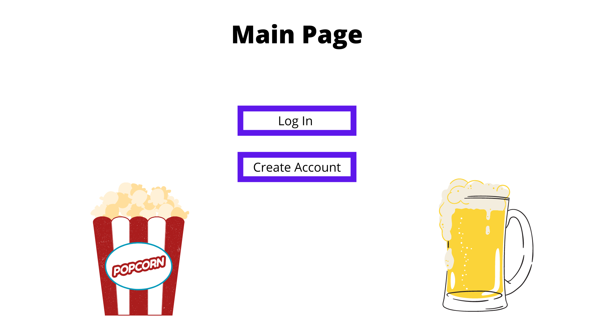

-   Login Page
    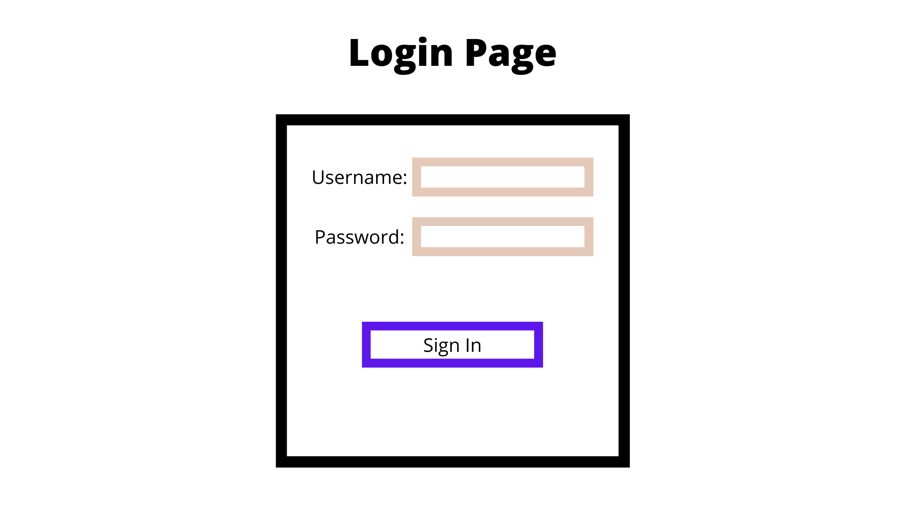

-   Dashboard
    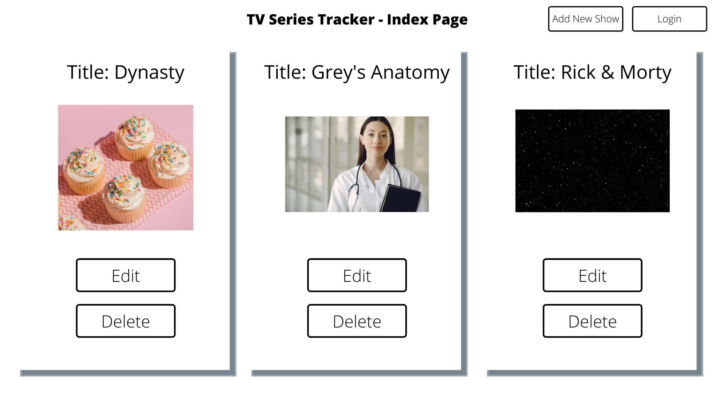

-   Show Route
    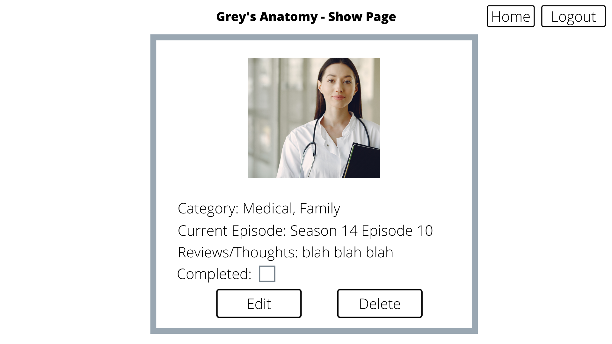

-   Add New Show
    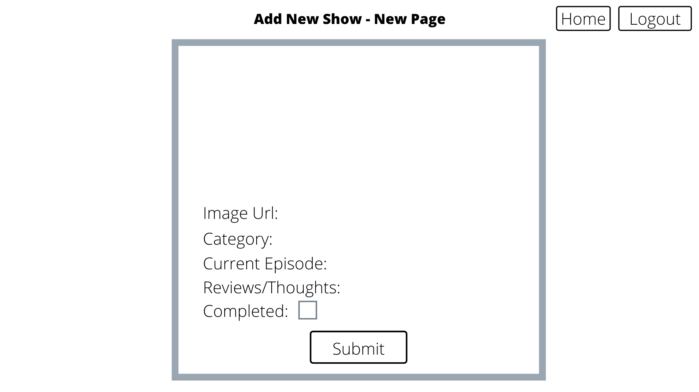

-   Edit Show
    ~[Edit Show Form](img/wireframe/edit.png)

## Approach Taken:

-   do up basic wireframe to visualize app
-   set up basic MVC structure with basic CRUD routes
-   set up database in MongoDB
-   set up authentication page
-   linked app to Heroku
-   test app functions

## Challenges:

-   Acessing shows as it's nested in User schema

## Screenshots:

-   Main App Landing Page
    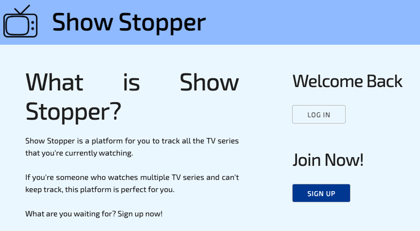

-   Login Page
    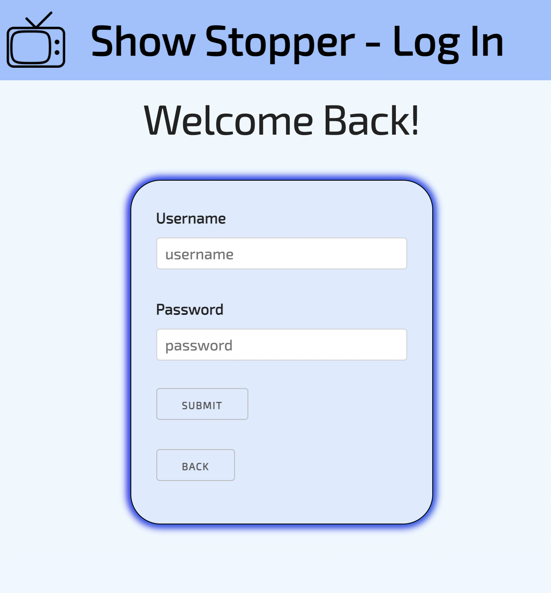

-   Sign Up Page
    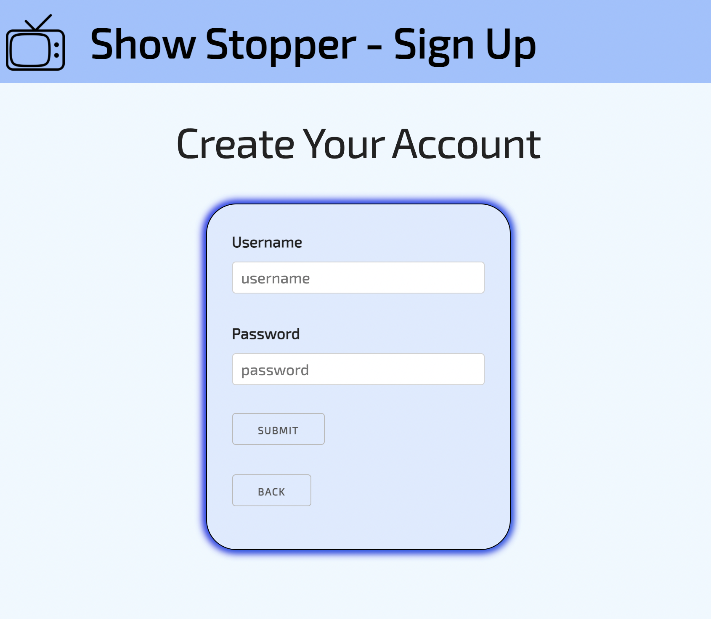

-   Authenticated User Page
    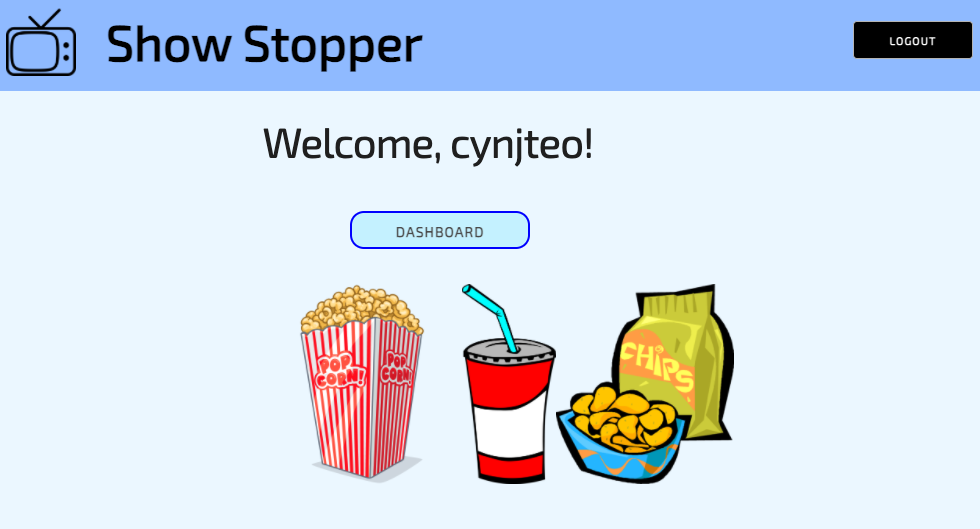

-   User Dashboard
    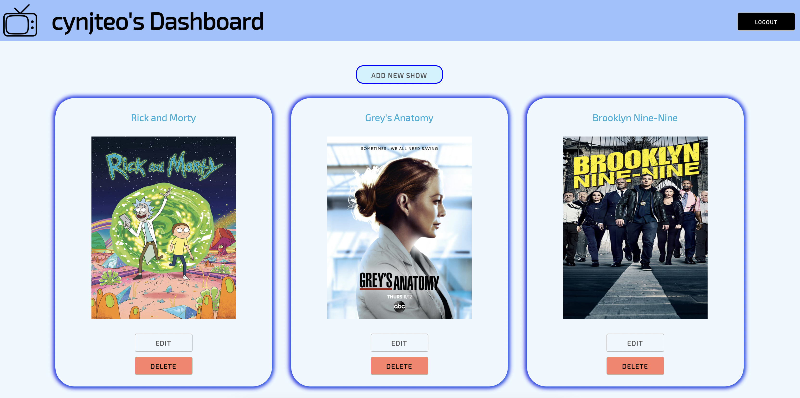

-   Add New Show Form
    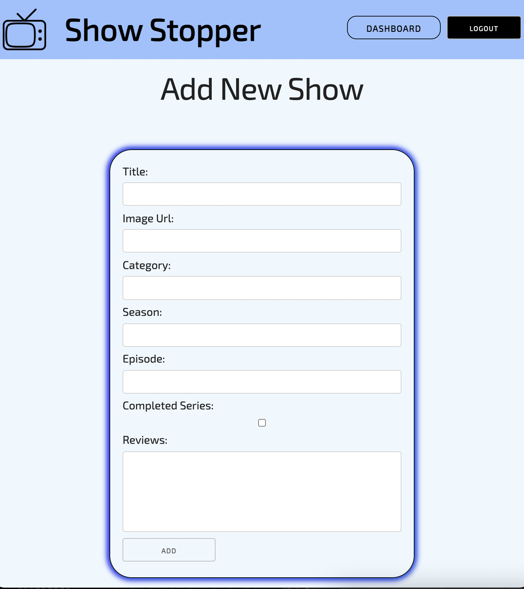

-   Edit Show Form
    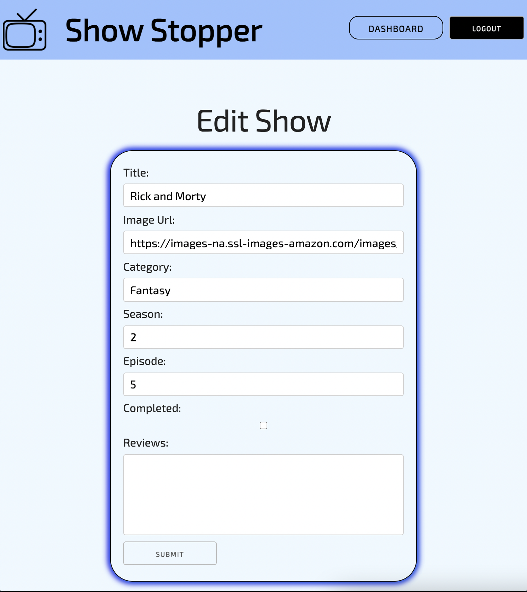

## RESTful Routes:

| No. | Route   | URL               | HTTP Verb | Description                                                  |
| --- | ------- | ----------------- | --------- | ------------------------------------------------------------ |
| 1.  | Index   | /                 | GET       | Main App Landing Page                                        |
|     |         | /app              | GET       | App Dashboard                                                |
| 2.  | New     | /sessions/new     | GET       | Log In Form                                                  |
|     |         | /users/new        | GET       | Sign Up Form                                                 |
|     |         | /app/new          | GET       | Add New Show Form                                            |
| 3.  | Create  | /sessions         | POST      | Authenticates credentials against database and redirect to / |
|     |         | /users            | POST      | Records new user into database and redirect to /             |
|     |         | /app              | POST      | Creates new show and redirect to /app                        |
| 4.  | Show    | /app/:showID      | GET       | Displays requested show                                      |
| 5.  | Edit    | /app/:showID/edit | GET       | Edit Form - Show Information /                               |
| 6.  | Update  | /app/:showID      | PUT       | Updates show and redirects to show page                      |
| 7.  | Destroy | /sessions         | DELETE    | Destroys session and redirect to /                           |
|     |         | /app/:showID      | DELETE    | Deletes requested show in database and redirects to Dasboard |

## Further Improvements:

-   different user interactions (e.g. commenting on other users' page)
-   input option to upload photos instead of using url
